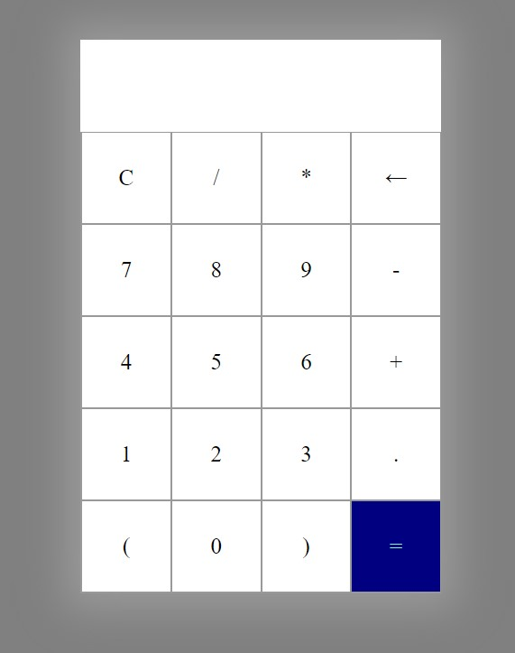

# CALCULATOR

## 1. Description
Simple calculator built with HTML, CSS, JavaScript

[DIRECT LINK](https://cbushehry.github.io/calculator/)

## 2. Features
 * Add, subtract, multiply, or divide any combination of numbers
 * Clear all /  delete buttons
 * ( Parenthesis )
 * Error! warning

 

## 3. Credits / Contact
This application was created by Cameron Bushehry

Contact me: c.bushehry@gmail.com